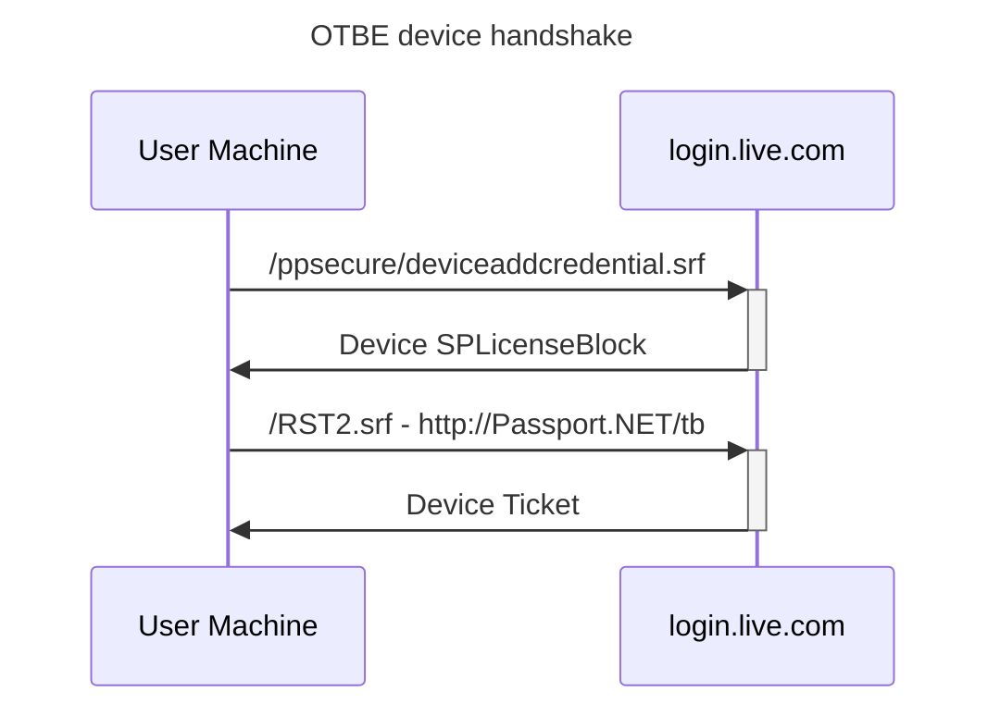

# Device Ticket flow

Below is the flow that happens in latest versions of Windows - involving TokenBroker



## deviceaddcredential.srf

The structure is a XML request with random membername and password
as well as DeviceInfo structure.

### Sample request

```xml
<?xml version="1.0"?>
<DeviceAddRequest>
  <ClientInfo name="IDCRL" version="1.0">
    <BinaryVersion>55</BinaryVersion>
  </ClientInfo>
  <Authentication>
    <!-- These values are random -->
    <Membername>02drqshbgqvqgnls</Membername>
    <Password>MPqGQL3bWcxHdQAzZ;`u</Password>
  </Authentication>
  <DeviceInfo Id="DeviceInfo">
    <Component name="4131">DgAAAFJUAGD2SlAAQwBJAAAA</Component>
    <!-- More Components here -->
    <TPMInfo>
      <KeyValue>
        <RSAKeyValue>
          <Modulus><!-- MODULUS --></Modulus>
          <Exponent>AQAB</Exponent>
        </RSAKeyValue>
        <StorageKeyBlob><!-- BLOB --></StorageKeyBlob>
      </KeyValue>
    </TPMInfo>
  </DeviceInfo>
</DeviceAddRequest>
```

### Components

All blobs are base64 encoded

- 4131 - MAC address
- 4112 - Details about disks in the PC (including serial number)
- 4113 - Subset of previous field - only serial number
- 4098 - Board manufacturer
- 4097 - Board version
- 4099 - Model of the PC
- 4100 - SMBIOS board version
- 4101 - SMBIOS serial number - assigned by OEM - can be empty with `error="-2147024894"`
- 4102 - SMBIOS UUID - assigned by OEM
- 8196 - CLEP blob #1 - possibly V2 request data
- 8197 - CLEP blob #2 - possibly V4 request data
- 4144 - ??? - 32 byte blob - SHA256 of something ??
- 4145 - SMBIOS chassis type
- 4160 - ?? - can be empty with `error="-2147024894"`
- 4161 - ?? - can be empty with `error="-2147024894"`

## RST2.srf

In below example it may be possible to ommit signatures in order to receive raw unencrypted data

### Sample request

```xml
<?xml version="1.0" encoding="UTF-8"?>
<s:Envelope xmlns:s="http://www.w3.org/2003/05/soap-envelope" xmlns:ps="http://schemas.microsoft.com/Passport/SoapServices/PPCRL" xmlns:wsse="http://docs.oasis-open.org/wss/2004/01/oasis-200401-wss-wssecurity-secext-1.0.xsd" xmlns:saml="urn:oasis:names:tc:SAML:1.0:assertion" xmlns:wsp="http://schemas.xmlsoap.org/ws/2004/09/policy" xmlns:wsu="http://docs.oasis-open.org/wss/2004/01/oasis-200401-wss-wssecurity-utility-1.0.xsd" xmlns:wsa="http://www.w3.org/2005/08/addressing" xmlns:wssc="http://schemas.xmlsoap.org/ws/2005/02/sc" xmlns:wst="http://schemas.xmlsoap.org/ws/2005/02/trust">
  <s:Header>
    <wsa:Action s:mustUnderstand="1">http://schemas.xmlsoap.org/ws/2005/02/trust/RST/Issue</wsa:Action>
    <wsa:To s:mustUnderstand="1">https://login.live.com:443/RST2.srf</wsa:To>
    <wsa:MessageID>1763885571</wsa:MessageID>
    <ps:AuthInfo xmlns:ps="http://schemas.microsoft.com/Passport/SoapServices/PPCRL" Id="PPAuthInfo">
      <ps:HostingApp>{DF60E2DF-88AD-4526-AE21-83D130EF0F68}</ps:HostingApp>
      <ps:BinaryVersion>55</ps:BinaryVersion>
      <ps:UIVersion>1</ps:UIVersion>
      <ps:InlineUX>TokenBroker</ps:InlineUX>
      <ps:IsAdmin>1</ps:IsAdmin>
      <ps:Cookies/>
      <ps:RequestParams>AQAAAAIAAABsYwQAAAAxMDMz</ps:RequestParams>
      <ps:WindowsClientString>b4d/QB7Zy5pjUAY9ByQ1echTyTITx6ZCErOEztuIVtw=</ps:WindowsClientString>
      <ps:LicenseSignatureKeyVersion>2</ps:LicenseSignatureKeyVersion>
      <ps:ClientCapabilities>1</ps:ClientCapabilities>
    </ps:AuthInfo>
    <wsse:Security>
      <wsse:UsernameToken wsu:Id="devicesoftware">
        <wsse:Username>02drqshbgqvqgnls</wsse:Username>
      </wsse:UsernameToken>
      <wsu:Timestamp wsu:Id="Timestamp">
        <wsu:Created>2025-11-23T00:12:51Z</wsu:Created>
        <wsu:Expires>2025-11-23T00:17:51Z</wsu:Expires>
      </wsu:Timestamp>
      <Signature xmlns="http://www.w3.org/2000/09/xmldsig#">
        <SignedInfo>
          <CanonicalizationMethod Algorithm="http://www.w3.org/2001/10/xml-exc-c14n#"/>
          <SignatureMethod Algorithm="http://www.w3.org/2001/04/xmldsig-more#rsa-sha256"/>
          <Reference URI="#RST0">
            <Transforms>
              <Transform Algorithm="http://www.w3.org/2001/10/xml-exc-c14n#"/>
            </Transforms>
            <DigestMethod Algorithm="http://www.w3.org/2001/04/xmlenc#sha256"/>
            <DigestValue>x1dexvML1H2TSmybLErItf/TxHV7Bw/h2oLBn0bfBSM=</DigestValue>
          </Reference>
          <Reference URI="#PPAuthInfo">
            <Transforms>
              <Transform Algorithm="http://www.w3.org/2001/10/xml-exc-c14n#"/>
            </Transforms>
            <DigestMethod Algorithm="http://www.w3.org/2001/04/xmlenc#sha256"/>
            <DigestValue>ox+bVisiipg2IbGqjRL5Om5WEefn5N71nFG68z2bglI=</DigestValue>
          </Reference>
          <Reference URI="#Timestamp">
            <Transforms>
              <Transform Algorithm="http://www.w3.org/2001/10/xml-exc-c14n#"/>
            </Transforms>
            <DigestMethod Algorithm="http://www.w3.org/2001/04/xmlenc#sha256"/>
            <DigestValue>yNF+r2eEOQRExfuSLR/jiOzo0/H3Ji2fuJHyYD7RZNs=</DigestValue>
          </Reference>
        </SignedInfo>
        <SignatureValue>PQ6vWwSNjkgskUyD0bYYvapRWBc/jPOj+SPWg/uahRHxBgwYi0to7XriIkbPFClmTkLAEhdPefnM/8NQTIvSoCH8TFLGoZ1HQC2w/eoxbLJLGptLbYYXri9kBVdPaqxtVetxODZ6mSWOEGR18bUFeFCql0h0knn8xwNFtm6ZzqKBvThMe4fkVGBxILvXIzlKKvS2Ut6pHxnbLRpPuAyx/3uJG/wsOkhbechbzOjVgyaTUzNm/4R/f0vjNrKy3xtNbxihkc1Ig32kg2HPxZUzc2BZonW9KdWC5yZDttybg9CxgZFmICf7LLuxWlf7wDqAmS3riE+5cyWiG771q23INw==</SignatureValue>
      </Signature>
    </wsse:Security>
  </s:Header>
  <s:Body>
    <wst:RequestSecurityToken Id="RST0">
      <wst:RequestType>http://schemas.xmlsoap.org/ws/2005/02/trust/Issue</wst:RequestType>
      <wsp:AppliesTo>
        <wsa:EndpointReference>
          <wsa:Address>http://Passport.NET/tb</wsa:Address>
        </wsa:EndpointReference>
      </wsp:AppliesTo>
    </wst:RequestSecurityToken>
  </s:Body>
</s:Envelope>

```