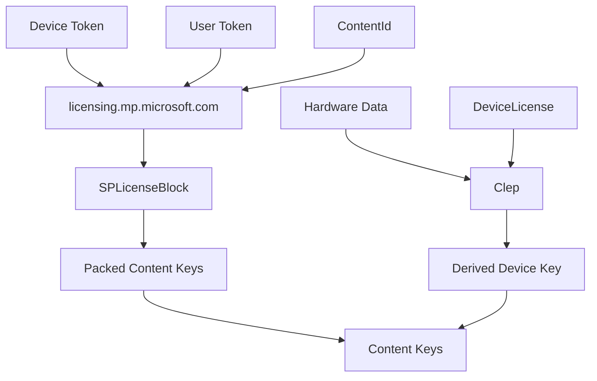

# App decryption flow

```mermaid
flowchart TD
    Dev["Device Token"] --> Lic["licensing.mp.microsoft.com"]
    Usr["User Token"] --> Lic
    Ct["ContentId"] --> Lic
    Lic --> SpL["SPLicenseBlock"]
    SpL --> EncK["Packed Content Keys"]

    DecLi["DeviceLicense"]
    Hw["Hardware Data"]
    C["Clep"]
    Hw-->C
    DecLi-->C
    C-->DK["Derived Device Key"]

    K["Content Keys"]
    EncK-->K
    DK-->K

```